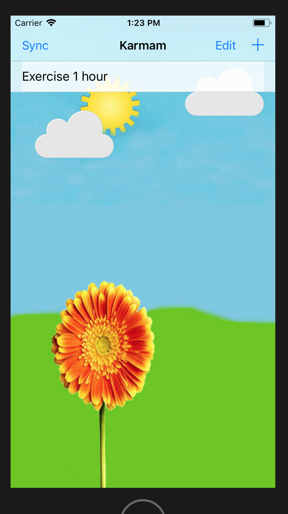
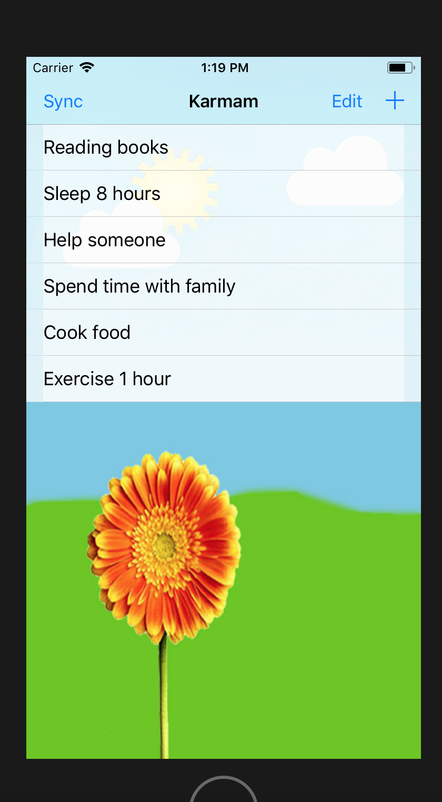
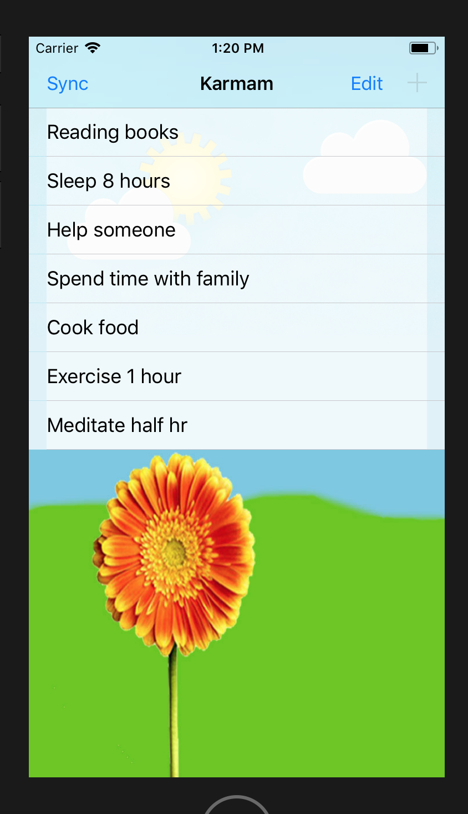

# karma-iOS-AWS-FBLogin

#### karma is a self initiated 3 day(2 day design+coding and 1 day testing + clean up + release) hackathon project. This project excercise consists of Objective-C coding, handling storyboard changes, Model-View-Controller design decisions, learning new technologies and integrating it with the project such as Amazon Web Services (AWS) - Dynamo DB(NoSql DB) , Facebook login Service etc. Also, I had to write few lines of swift code for AWS support and made those methods called from objective-C . 

Karma app is indeed meant to be a simple app but it has some features which makes it unique and others existing apps does not provide. The purpose of this app are  
** Track seven or less most important daily task that you feel it improves your life. This is not a todo app but for someone who practices yoga, it is those seven karmas that helps them achieve their ultimate goal.  
** It is lack of motivation that restricts people from practicing their daily karma/tasks. Motivation to achieve this seven goals is through the garden that you build on the screen. To get the garden to have at it’s best, the user has to accomplish all of his goals. This gamification of daily goals is one of the unique feature of the app.   
** This app saves the Karmas in cloud using Amazon Web Services (AWS) - Dynamo DB(NoSql DB).  
** The app also provides a login using facebook.  
** I have similar app in Android since 2015 - https://github.com/varunrpillai/karma  

## Screenshots

  
  
  
